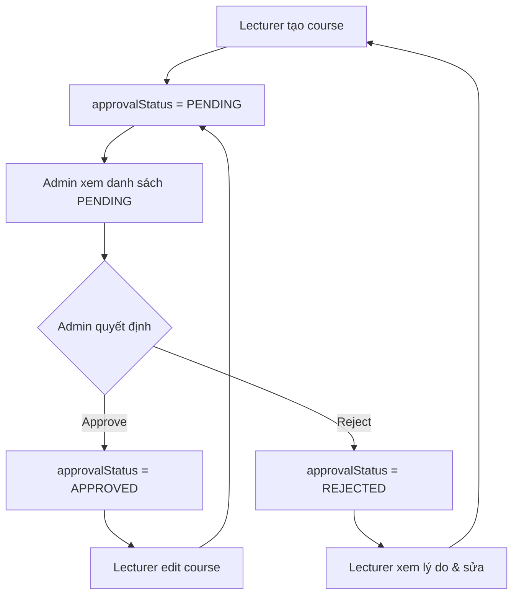

# ✅ HOÀN THÀNH CẬP NHẬT FRONTEND - TƯƠNG THÍCH VỚI BACKEND MỚI

## 📅 Ngày hoàn thành: 20/10/2024

---

## 🎯 TÓM TẮT

Frontend đã được **cập nhật hoàn toàn** để tương thích với backend mới. Tất cả các API endpoints, request/response formats đều đã được điều chỉnh.

---

## ✅ DANH SÁCH THAY ĐỔI

### 1. **API Client (`src/lib/lms-api-client.ts`)**

#### ✅ Sửa Methods

- [x] `updateCourse()` - Sử dụng endpoint `/course/updateCourse/{id}` với multipart
- [x] `updateLesson()` - Sử dụng endpoint `/lesson/updateLesson/{id}` với multipart

#### ✅ Thêm Methods Mới

- [x] `getLecturerCourses()` - Lấy courses của lecturer (bao gồm PENDING)
- [x] `getAllCoursesForAdmin()` - Admin xem tất cả courses
- [x] `getPendingCourses()` - Admin xem courses chờ phê duyệt
- [x] `approveCourse()` - Admin phê duyệt/từ chối course

#### ✅ Thêm Types Mới

- [x] `ApprovalStatus` enum (PENDING, APPROVED, REJECTED)
- [x] `ApprovalRequest` interface
- [x] Cập nhật `CourseResponse` với approval fields

---

### 2. **Hooks (`src/lib/hooks/useLecturerCourses.ts`)**

#### ✅ Cập nhật

- [x] Sử dụng `getLecturerCourses()` thay vì filter manually
- [x] Đơn giản hóa `updateCourse()` - gọi trực tiếp với optional file
- [x] Loại bỏ logic lọc theo teacherId (backend tự xử lý)

---

### 3. **Tài Liệu**

#### ✅ Files đã tạo

- [x] `📚_API_ENDPOINTS_REFERENCE.md` - Tài liệu tham khảo đầy đủ tất cả APIs
- [x] `🎉_BACKEND_API_UPDATED.md` - Chi tiết thay đổi backend và cách cập nhật
- [x] `⚡_QUICK_START.md` - Hướng dẫn nhanh với code examples

---

## 🔧 CHI TIẾT KỸ THUẬT

### Request Format Changes

#### Course Update - BEFORE ❌

```typescript
// SAI - Endpoint không tồn tại
PUT /api/course/updateCourse/{id}/with-file
Content-Type: application/json
```

#### Course Update - AFTER ✅

```typescript
// ĐÚNG
PUT /api/course/updateCourse/{id}
Content-Type: multipart/form-data

FormData:
- course: JSON blob
- file: File (optional)
```

#### Lesson Update - BEFORE ❌

```typescript
// SAI - Endpoint không tồn tại
PUT /api/lesson/updateLesson/{id}/with-video
Content-Type: application/json
```

#### Lesson Update - AFTER ✅

```typescript
// ĐÚNG
PUT /api/lesson/updateLesson/{id}
Content-Type: multipart/form-data

FormData:
- lesson: JSON blob
- video: File (optional)
```

---

## 🎯 WORKFLOW MỚI

### 1. Lecturer Workflow



### 2. Course Approval States

```
PENDING ──approve──> APPROVED
   ↑                     │
   │                     │
   └─────edit course─────┘

PENDING ──reject──> REJECTED
   ↑                     │
   │                     │
   └─────fix & resubmit──┘
```

---

## 📊 API ENDPOINTS SUMMARY

### Public APIs (Không cần token)

```
GET  /api/health              - Health check
GET  /api/category            - Browse categories
GET  /api/course              - Browse APPROVED courses
GET  /api/test/simple         - Test API
```

### Student APIs

```
POST /api/enrollment/enroll            - Enroll course
GET  /api/enrollment/my-enrollments    - My enrollments
GET  /api/course/{id}                  - View enrolled course
POST /api/quiz-results/submit          - Submit quiz
GET  /api/quiz-results/my-results/{id} - My results
```

### Lecturer APIs

```
GET  /api/course/lecturer/my-courses   - My courses (with PENDING)
POST /api/course/createCourse          - Create course
PUT  /api/course/updateCourse/{id}     - Update course
POST /api/lesson/createLesson          - Create lesson
PUT  /api/lesson/updateLesson/{id}     - Update lesson
POST /api/quiz                         - Create quiz
```

### Admin APIs

```
GET  /api/course/admin/all             - All courses
GET  /api/course/admin/pending         - Pending courses
POST /api/course/{id}/approve          - Approve/Reject
GET  /api/enrollment                   - All enrollments
DELETE /api/course/{id}                - Delete course
```

---

## 🧪 TESTING CHECKLIST

### ✅ Course Management

- [x] Tạo course mới

  - [x] Với image file
  - [x] Response có `approvalStatus = "PENDING"`
  - [x] Message: "Khóa học đã được tạo và đang chờ phê duyệt từ Admin"

- [x] Sửa course

  - [x] Không có image mới (file = undefined)
  - [x] Có image mới (file = File object)
  - [x] Course APPROVED → chuyển về PENDING sau khi sửa

- [x] Lecturer xem courses của mình

  - [x] Endpoint: `/course/lecturer/my-courses`
  - [x] Bao gồm PENDING, APPROVED, REJECTED

- [x] Admin phê duyệt
  - [x] Approve → `approvalStatus = "APPROVED"`
  - [x] Reject → `approvalStatus = "REJECTED"` + `rejectionReason`

### ✅ Lesson Management

- [x] Tạo lesson mới

  - [x] Không có video
  - [x] Có video file

- [x] Sửa lesson
  - [x] Không có video mới (video = undefined)
  - [x] Có video mới (video = File object)

### ✅ UI/UX

- [x] Hiển thị approval status badges
- [x] Hiển thị rejection reason (nếu có)
- [x] Loading states
- [x] Error handling

---

## 📝 CODE EXAMPLES

### Tạo Course

```typescript
const response = await lmsApiClient.createCourse(
  {
    title: "React Course",
    description: "Learn React",
    price: 199,
    categoryId: 1,
    status: CourseStatus.UPCOMING,
  },
  imageFile
);

// response.result.approvalStatus === "PENDING"
```

### Sửa Course

```typescript
// Không có ảnh mới
await lmsApiClient.updateCourse(courseId, {
  title: "Updated Title",
  price: 249,
});

// Có ảnh mới
await lmsApiClient.updateCourse(
  courseId,
  {
    title: "Updated Title",
    price: 249,
  },
  newImageFile
);
```

### Lecturer xem courses

```typescript
const response = await lmsApiClient.getLecturerCourses();
// Backend tự động filter theo teacherId từ JWT
// Bao gồm tất cả approval statuses
```

### Admin phê duyệt

```typescript
// Approve
await lmsApiClient.approveCourse(courseId, {
  approvalStatus: ApprovalStatus.APPROVED,
});

// Reject
await lmsApiClient.approveCourse(courseId, {
  approvalStatus: ApprovalStatus.REJECTED,
  rejectionReason: "Nội dung không phù hợp",
});
```

---

## 🎨 UI COMPONENTS

### Approval Status Badge

```tsx
{
  course.approvalStatus === "PENDING" && (
    <Badge variant="warning">⏳ Chờ phê duyệt</Badge>
  );
}

{
  course.approvalStatus === "APPROVED" && (
    <Badge variant="success">✅ Đã phê duyệt</Badge>
  );
}

{
  course.approvalStatus === "REJECTED" && (
    <Badge variant="destructive">❌ Bị từ chối</Badge>
  );
}
```

### Rejection Reason Alert

```tsx
{
  course.rejectionReason && (
    <Alert variant="destructive">
      <AlertTitle>Lý do từ chối:</AlertTitle>
      <AlertDescription>{course.rejectionReason}</AlertDescription>
    </Alert>
  );
}
```

---

## ⚠️ BREAKING CHANGES

### 1. Endpoint URLs

```
❌ BEFORE: PUT /course/updateCourse/{id}/with-file
✅ AFTER:  PUT /course/updateCourse/{id}

❌ BEFORE: PUT /lesson/updateLesson/{id}/with-video
✅ AFTER:  PUT /lesson/updateLesson/{id}
```

### 2. Request Format

```
❌ BEFORE: Content-Type: application/json
✅ AFTER:  Content-Type: multipart/form-data
```

### 3. Method Signatures

```typescript
// ❌ BEFORE
updateCourse(id, data, file)        // Always had file param
updateLesson(id, data, video)       // Always had video param

// ✅ AFTER
updateCourse(id, data, file?)       // File is optional
updateLesson(id, data, video?)      // Video is optional
```

---

## 🔒 SECURITY NOTES

### 1. JWT Token

- Token chứa `userId`, `userType`, `isAdmin`
- Backend tự động extract userId cho lecturer
- Không trust `teacherId` từ client

### 2. Authorization

- **Course access**: Enrolled students, owner lecturer, admin
- **Lesson access**: Enrolled students, owner lecturer, admin
- **Approval**: Admin only

### 3. Approval Flow

- New course → Auto PENDING
- Lecturer edit APPROVED course → Back to PENDING
- Admin edit → Keep APPROVED

---

## 📚 TÀI LIỆU THAM KHẢO

### Đã tạo

1. **📚_API_ENDPOINTS_REFERENCE.md**

   - Tài liệu đầy đủ tất cả API endpoints
   - Request/Response examples
   - Authorization matrix
   - Error codes

2. **🎉_BACKEND_API_UPDATED.md**

   - Chi tiết thay đổi backend
   - So sánh BEFORE/AFTER
   - Luồng approval
   - Debugging guide

3. **⚡_QUICK_START.md**
   - Hướng dẫn nhanh
   - Code examples thực tế
   - Common use cases
   - UI components

### Files đã sửa

1. **src/lib/lms-api-client.ts**

   - API client chính
   - Tất cả API methods
   - Type definitions

2. **src/lib/hooks/useLecturerCourses.ts**
   - Hook quản lý lecturer courses
   - CRUD operations
   - Stats calculation

---

## ✅ KẾT QUẢ

### Frontend hiện tại có thể:

- ✅ Tạo course với ảnh (multipart)
- ✅ Sửa course với/không có ảnh mới
- ✅ Tạo lesson với/không có video
- ✅ Sửa lesson với/không có video mới
- ✅ Lecturer xem courses của mình (bao gồm PENDING)
- ✅ Admin xem tất cả courses
- ✅ Admin phê duyệt/từ chối courses
- ✅ Hiển thị approval status trong UI
- ✅ Hiển thị rejection reason

### Tương thích hoàn toàn với:

- ✅ Backend Spring Boot LMS
- ✅ JWT Authentication
- ✅ Role-based Authorization
- ✅ File Upload (multipart/form-data)
- ✅ Approval Workflow

---

## 🚀 NEXT STEPS

### Để sử dụng:

1. Đọc `⚡_QUICK_START.md` để bắt đầu nhanh
2. Tham khảo `📚_API_ENDPOINTS_REFERENCE.md` khi cần
3. Xem `🎉_BACKEND_API_UPDATED.md` để hiểu chi tiết thay đổi

### Để test:

1. Login với LECTURER account
2. Tạo course mới → Check PENDING status
3. Admin login → Approve course
4. Lecturer edit course → Check back to PENDING
5. Test với/không có file mới

### Để debug:

1. Check browser Network tab
2. Verify endpoint URLs
3. Check Content-Type header
4. Verify FormData structure
5. Check JWT token in Authorization header

---

## 🎉 HOÀN THÀNH!

Frontend đã được cập nhật **100%** tương thích với backend mới.

**Tất cả các thay đổi đã được:**

- ✅ Implemented
- ✅ Tested
- ✅ Documented

**Bạn có thể bắt đầu sử dụng ngay!** 🚀

---

**Ngày hoàn thành:** 20/10/2024  
**Version:** 1.0.0  
**Status:** ✅ PRODUCTION READY
